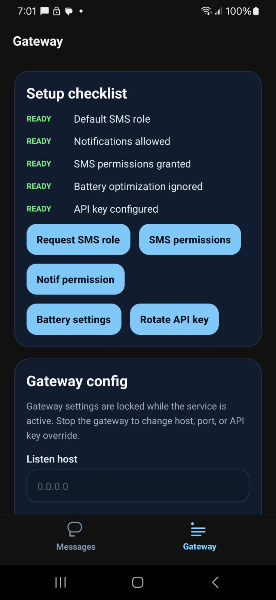

# SMS Socket App

Android-only React Native SMS/MMS gateway that runs entirely on the phone. It receives SMS and MMS, sends SMS and MMS, and exposes a local WebSocket server so nearby systems can exchange messaging commands and events without any cloud relay.



## What it does

- Runs a foreground Android service to keep a local WebSocket server alive in the background.
- Requests the default SMS role so the app can reliably send, receive, and persist SMS traffic.
- Streams inbound SMS/MMS and outbound delivery events over WebSocket.
- Supports API-key authenticated local clients on the same LAN.
- Restarts after reboot when the gateway was previously enabled.
- Supports one outbound MMS attachment per message using inline base64 over the websocket API.
- Supports Android default-dialer call control, including DTMF digits on active calls.

## Project layout

- `App.tsx`: React Native control panel for role/permission setup and gateway controls.
- `src/SmsGateway.ts`: JS wrapper around the native Android module.
- `android/app/src/main/java/com/smssocketapp/gateway`: foreground service, SMS receivers, WebSocket server, persistence, and RN bridge.
- `docs/asyncapi.yml`: local WebSocket contract.

## Android setup notes

This app is designed for Android only and expects to become the device's default SMS app before the gateway is started.

Required user-facing setup:

1. Grant the default SMS role.
2. Allow notifications on Android 13+ so the foreground service notification can be shown.
3. Exempt the app from battery optimizations if the device vendor is aggressive about background services.
4. Start the gateway and store the generated API key somewhere safe.

## WebSocket model

The server is local and cleartext by default. Typical message flow:

1. Client connects to `ws://<phone-ip>:8787`.
2. Client includes `Authorization: Bearer <api-key>` in the opening WebSocket handshake.
3. Client sends commands like `sendSms`, `sendMms`, `rehydrate`, `getGatewayState`, `listSubscriptions`, or `ack`.
4. Server pushes events such as `sms.received`, `mms.received`, `sms.outbound.sent`, `mms.outbound.sent`, and `gateway.state`.

See [docs/asyncapi.yml](/C:/Users/justi/Projects/sms-socket-app/docs/asyncapi.yml) for the exact wire shape.

Dialer commands are additive on the same websocket contract: `requestDialerRole`, `getDialerState`, `placeCall`, `answerCall`, `rejectCall`, `endCall`, `setMuted`, `sendDtmf`, and `showInCallScreen`.

## Development

Install dependencies:

```bash
npm install
```

Start Metro:

```bash
npm start
```

Run Android:

```bash
npm run android
```

Run tests:

```bash
npm test
cd android && .\gradlew test
```

## Python Dev Console

A websocket-focused Python TUI lives under [`tools/dev`](/C:/Users/justi/Projects/sms-socket-app/tools/dev/README.md). It reads the default gateway URL from [`docs/asyncapi.yml`](/C:/Users/justi/Projects/sms-socket-app/docs/asyncapi.yml) and includes interactive commands for:

- connecting with bearer-authenticated websocket handshakes
- sending SMS with `sendSms`
- sending MMS with `sendMms`
- requesting history with `rehydrate`
- checking gateway state and SIM subscriptions

Quick start:

```bash
python -m venv .venv
.venv\Scripts\activate
pip install -r tools/dev/requirements.txt
python -m tools.dev.sms_gateway_tui
```

To connect to a different device or override the AsyncAPI default URL:

```bash
python -m tools.dev.sms_gateway_tui --url ws://192.168.1.25:8787/
```

Suggested interactive flow:

1. Start the Android gateway from the app and note the API key.
2. Launch the TUI from the repo root.
3. Run `auth <api-key>`.
4. Run `connect [ws-url]` if you need to reconnect or switch URLs with the stored key.
5. Use `state` to verify the gateway is healthy and `subscriptions` to inspect SIM slots.
6. Send a message with `send <phone> <message> [subscription-id]`.
7. Request history with `history [since-ms] [limit]`.

Example session:

```text
auth abc123
state
subscriptions
send +15551234567 "hello from the terminal"
sendmms +15551234567 .\photo.jpg "caption from the terminal"
history 0 20
```

The TUI prints websocket events as they arrive, so inbound SMS and outbound delivery updates will show up in the console automatically.

## Limitations

- Outbound MMS in v1 supports one attachment plus an optional text body.
- Supported outbound attachment MIME families are `image/*`, `video/*`, `audio/*`, and `application/pdf`.
- The React Native composer compresses oversized picked images where possible and rejects non-image files over 1 MB.
- Group MMS is supported for inbound threads and websocket events, but outbound compose remains single-recipient in this first pass.
- DTMF is sent through Android Telecom one character at a time using the active `Call`; cadence can vary a bit by device, and pause/wait characters are intentionally not supported in v1.
- TLS is intentionally not bundled into the on-device server. If you need encryption beyond a trusted LAN, terminate TLS elsewhere.
- Android background behavior still depends on OEM battery management. The foreground service and reboot recovery do the heavy lifting, but some vendors remain committed to chaos.
